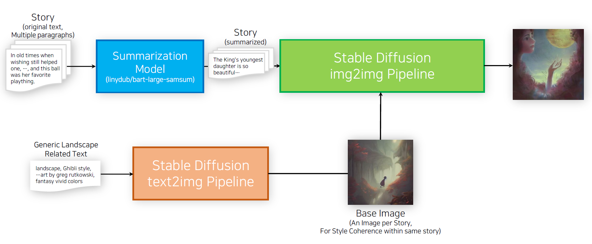
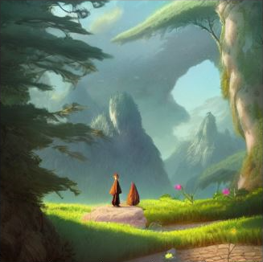
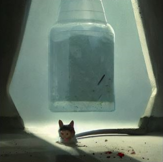

# Generating Illustrations for Stories by Raw Text
Python code for generating illustrations for stories with original texts using Stable Diffusion and BART
### Pipeline

### example)
|Original Text|
|-|
|They set out on their way, but when they arrived, the pot of fat certainly was still in its place, but it was empty. “Alas!” said the mouse, “now I see what has happened, now it comes to light! You are a true friend! You have devoured all when you were standing godmother. First top off, then half done, then ?.” “Will you hold your tongue,” cried the cat, “one word more and I will eat you too.” “All gone” was already on the poor mouse’s lips; scarcely had she spoken it before the cat sprang on her, seized her, and swallowed her down. Verily, that is the way of the world.|

|Base Image|Summarized Text|Generated Image|
|-|-|-|
||The pot of fat was still in its place, but it was empty. The cat devoured it. The mouse is angry at the cat for eating it.||
## How to use
### 1. Install the following package
  - diffusers==0.3.0
  - transformers
  - pytorch (must install version corresponding to local cuda version)
  - pandas
  - huggingface_hub
  - tqdm

### 2. Log in to huggingface
Open shell and login local machine to huggingface. Enter Access Token provided from your huggingface account. 
```bash
huggingface-cli login
```
Read this [huggingface documentation](https://huggingface.co/docs/hub/security-tokens) for more information

### 3. Get Grimm Fairy Tale Dataset
Clone [edong6768/Grimm-Fairy-Tale-Korean-English-Pair-Data-Preprocessing](https://github.com/edong6768/Grimm-Fairy-Tale-Korean-English-Pair-Data-Preprocessing) and run code to obtain `fairy_tale_grimm.tsv`.
```
git clone https://github.com/edong6768/Grimm-Fairy-Tale-Korean-English-Pair-Data-Preprocessing.git
```
Then move this file to `data` folder.

### 4. Run `Illustration_Generation.py` to generate images
Generated images will be saved within data/genearated_images
